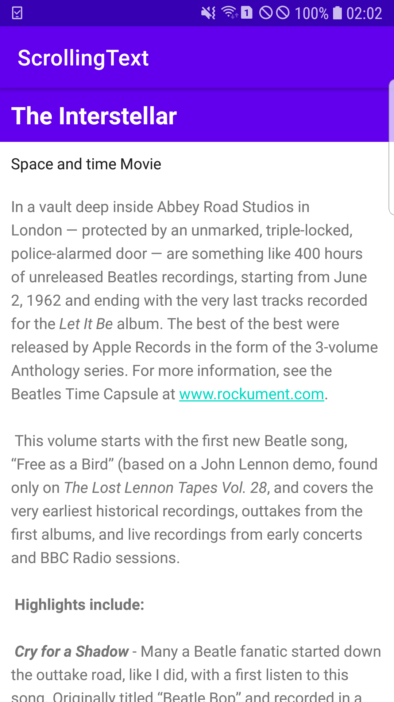
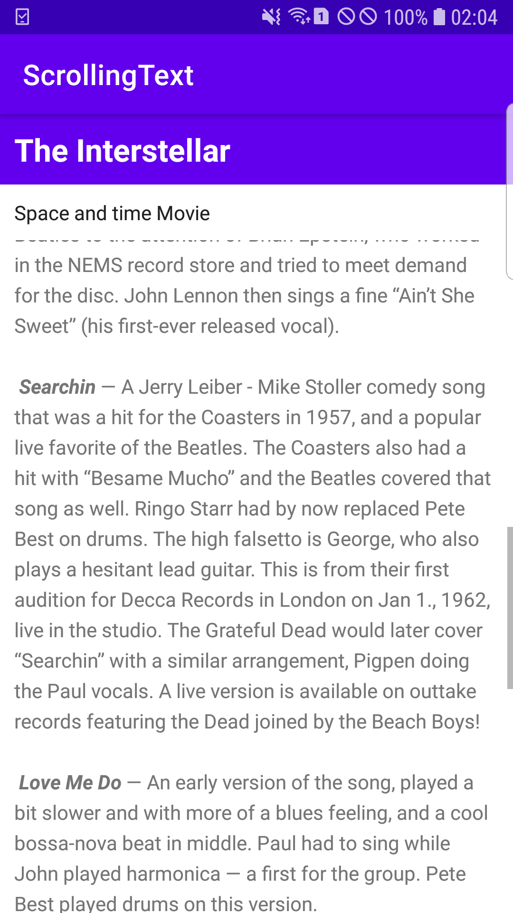
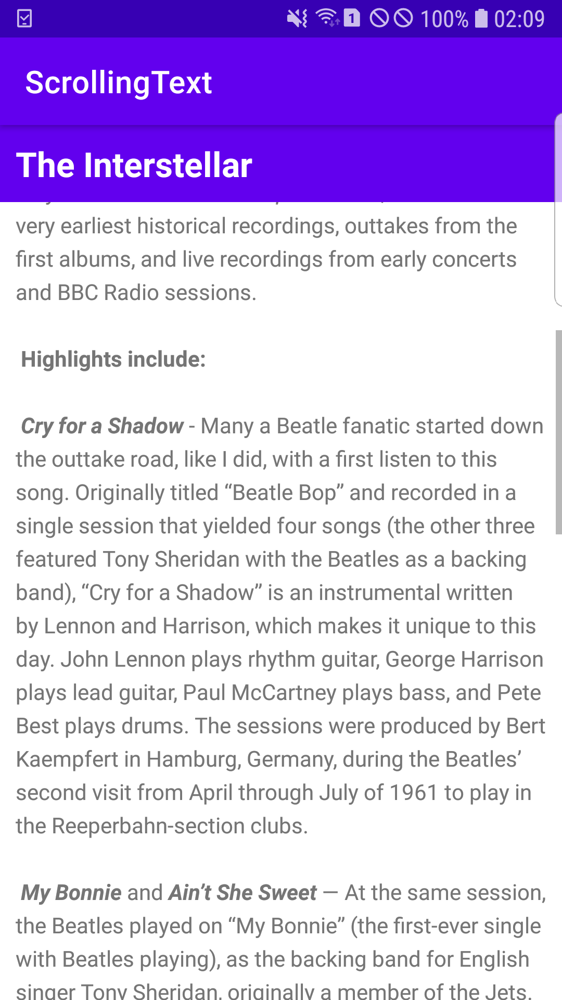

# Lab 3: Task Section

**This branch consists of the 'Task Section' for the Lab 3 of DMA module. There are 3 tasks for this lab exercise and they are
presented below along with the screenshots.**

---

## Task 1: The App UI

**The screenshot above shows the final UI of the app that was created in the task 1. The UI has some text views; heading, sub-heading 
and the article. The weblink provided within the article is not active at the moment and the application is not scrollable too.**

---

## Task 2: Adding ScrollView and Active Link

**The screenshot above shows the implementation of the scroll feature in the final app using the scrollView view group. The article 
section was enclosed in the scrollView and the web link was also made active. The scroll-line shown in the screenshot is the 
proof for the scroll feature enabled in the app.**

---

## Task 3: Scrolling Multiple Elements

**The screenshot above shows the scrolling feature where the sub-heading is also being scrolled with the article. It was done by 
enclosing both the sub-heading and article sections in the scrollView view group.**